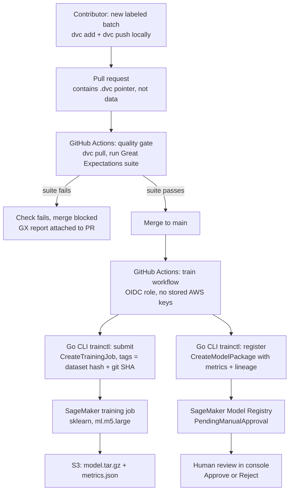

# retrain-pipeline

**CI-driven MLOps pipeline with data quality gates and human-in-the-loop model governance.**

Bad data cannot merge, every model traces back to an exact dataset hash and Git commit, and no model
is promoted without a human reading the evaluation.

New labeled data enters through a pull request. Great Expectations validates it before the merge can
happen. DVC versions it with a content hash. A Go CLI (`trainctl`) submits a SageMaker training job
tagged with the dataset hash and Git SHA, then registers the result in the SageMaker Model Registry
as `PendingManualApproval` with its eval metrics attached. Nothing ships until a human reads the
metrics and approves.

> **Status:** in development.

## Architecture

This is the **continuous training** pattern: data and code both enter through Git, validation gates
the merge, the merge triggers training, and the registry gates promotion. The trigger is CI-driven,
not event-driven. There is no queue and no event bus in this design.

## Repository layout

| Path | Contents |
|---|---|
| `terraform/` | Buckets, IAM roles, GitHub OIDC provider, model package group |
| `training/` | `train.py` (dual-mode local/SageMaker) and the Great Expectations suite |
| `cmd/trainctl/` | Go CLI: `submit` and `register` |
| `data/` | DVC pointer files only, never the data itself |
| `.github/workflows/` | `quality-gate` (on data PRs) and `train` (on merge to main) |

## Related projects

Part of a three-repo portfolio covering the model lifecycle on AWS:

- [`go-rag-api`](https://github.com/Go-Santiago-Go/go-rag-api) — retrieval
- [`infer-gateway`](https://github.com/Go-Santiago-Go/infer-gateway) — serving and scaling
- **`retrain-pipeline`** — training and governance (this repo)
