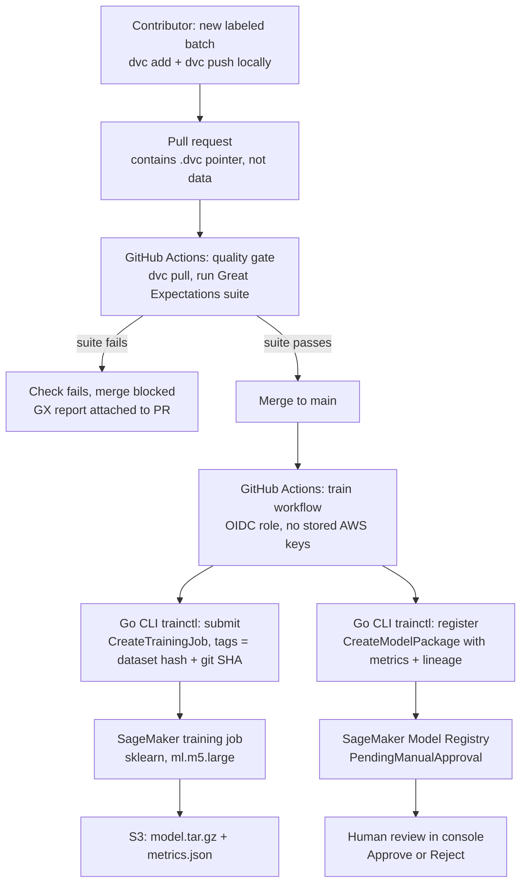

# retrain-pipeline

**CI-driven MLOps pipeline with data quality gates and human-in-the-loop model governance.**

Bad data cannot merge, every model traces back to an exact dataset hash and Git commit, and no model
is promoted without a human reading the evaluation.

New labeled data enters through a pull request. Great Expectations validates it before the merge can
happen. DVC versions it with a content hash. A Go CLI (`trainctl`) submits a SageMaker training job
tagged with the dataset hash and Git SHA, then registers the result in the SageMaker Model Registry
as `PendingManualApproval` with its eval metrics attached. Nothing ships until a human reads the
metrics and approves.

> **Status:** in development. Phase 1 (AWS infrastructure) is provisioned and verified, and Phase 2
> (dataset and dual-mode training script) trains locally against the frozen holdout. The quality-gate,
> DVC versioning, and governance phases are in progress.

## Architecture



This is the **continuous training** pattern: data and code both enter through Git, validation gates
the merge, the merge triggers training, and the registry gates promotion. The trigger is CI-driven,
not event-driven. There is no queue and no event bus in this design.

## Repository layout

| Path | Contents |
|---|---|
| `terraform/` | Buckets, IAM roles, GitHub OIDC provider, model package group |
| `training/` | `train.py` (dual-mode local/SageMaker), `split_dataset.py` (one-shot holdout carve), and the Great Expectations suite |
| `cmd/trainctl/` | Go CLI: `submit` and `register` |
| `data/` | DVC pointer files only, never the data itself |
| `.github/workflows/` | `quality-gate` (on data PRs) and `train` (on merge to main) |

## Infrastructure

All AWS resources are defined in Terraform (`terraform/`), with remote state in S3 using native
lockfile locking (no DynamoDB table). Nothing in this layer bills while idle.

| Resource | Purpose |
|---|---|
| Three S3 buckets | DVC remote, model artifacts, Terraform state |
| GitHub OIDC provider | Keyless CI auth; account-global, so referenced (not owned) by this repo |
| CI IAM role | Assumed by GitHub Actions via OIDC. Starts training jobs, never runs them |
| SageMaker execution role | Assumed by the training job. Writes artifacts and logs, nothing more |
| Model package group | Registry container for versioned model packages |

**Security posture.** CI authenticates to AWS through GitHub OIDC federation, so there are no
long-lived AWS keys in GitHub secrets. The role trust policy is scoped to this repository's immutable
subject claim on `main` and `pull_request`. The two IAM roles are kept separate and least-privilege:
CI can start training jobs but cannot write model artifacts, and its `iam:PassRole` is scoped to the
single execution role and to SageMaker alone, closing the privilege-escalation path.

Buckets block public access, use SSE-S3 encryption, and carry lifecycle rules that abort incomplete
multipart uploads. State is versioned; the two write-once application buckets are not.

## Dataset and training

The dataset is the [UCI SMS Spam Collection](https://archive.ics.uci.edu/dataset/228/sms+spam+collection):
5,574 real English text messages, each labeled `ham` or `spam`, roughly 87/13.

Before any model trains, `training/split_dataset.py` carves a **frozen holdout** once: a stratified 20
percent split under a fixed seed, written to `data/holdout.csv` and never regenerated. The holdout is
the fixed ruler every future model is measured against, so metrics stay comparable across retrains and
no run can leak test data into training. The split logic lives in this one-shot script, not in
`train.py`, so a training run structurally cannot resplit.

`training/train.py` is **dual-mode**: SageMaker script mode passes data and output locations through
`SM_CHANNEL_TRAIN` and `SM_MODEL_DIR`, and those default to local paths, so the identical file runs on
a laptop and in the cloud with no branching. The model stays deliberately boring: a TF-IDF plus
LogisticRegression `sklearn.Pipeline`, where the single Pipeline is the leakage guard, fitting the
vectorizer on training data only and reusing it on the holdout. Each run writes `model.joblib` and
`metrics.json` into the model directory, so in SageMaker they tar into one `model.tar.gz` and the
metrics travel with the model the registry will grade.

Run it locally:

```bash
python -m venv .venv && source .venv/bin/activate
pip install -r training/requirements.txt

# fetch the raw dataset (gitignored and re-downloadable; DVC replaces this in Phase 4)
mkdir -p data/raw
curl -sL "https://archive.ics.uci.edu/static/public/228/sms+spam+collection.zip" -o data/raw/smsspam.zip
unzip -o data/raw/smsspam.zip -d data/raw/

python training/split_dataset.py   # one-shot; carves the frozen holdout
python training/train.py           # trains, evaluates, writes metrics.json
```

The current local baseline on the frozen holdout is accuracy 0.97, precision 1.00, recall 0.81, F1
0.90. Precision and recall are reported separately because for a spam filter their costs differ: a
false positive junks a real message, while a false negative merely lets one spam through.

## Related projects

Part of a three-repo portfolio covering the model lifecycle on AWS:

- [`go-rag-api`](https://github.com/Go-Santiago-Go/go-rag-api) — retrieval
- [`infer-gateway`](https://github.com/Go-Santiago-Go/infer-gateway) — serving and scaling
- **`retrain-pipeline`** — training and governance (this repo)
