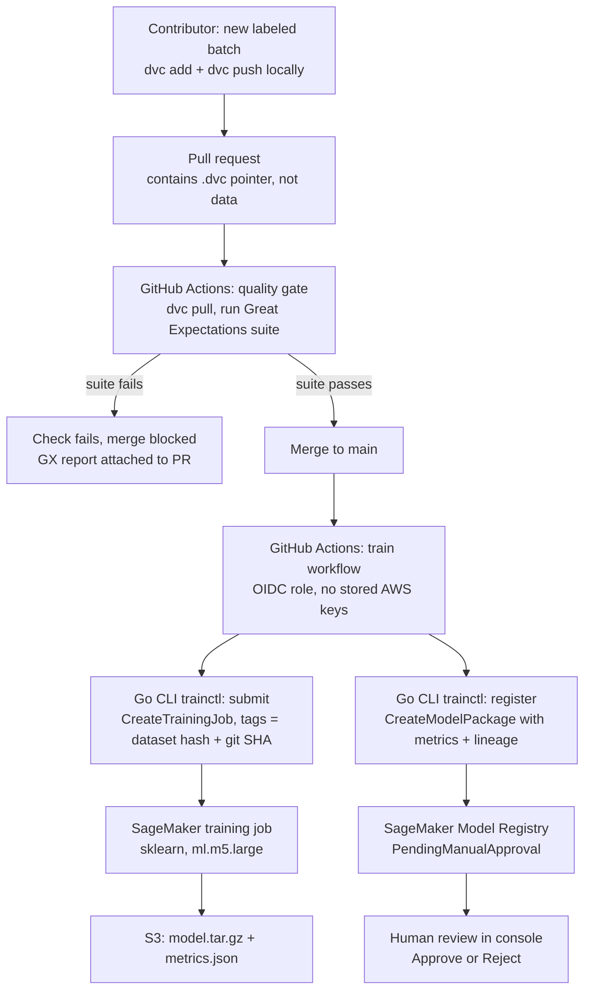

# retrain-pipeline

**CI-driven MLOps pipeline with data quality gates and human-in-the-loop model governance.**

Bad data cannot merge, every model traces back to an exact dataset hash and Git commit, and no model
is promoted without a human reading the evaluation.

New labeled data enters through a pull request. Great Expectations validates it before the merge can
happen. DVC versions it with a content hash. A Go CLI (`trainctl`) submits a SageMaker training job
tagged with the dataset hash and Git SHA, then registers the result in the SageMaker Model Registry
as `PendingManualApproval` with its eval metrics attached. Nothing ships until a human reads the
metrics and approves.

> **Status:** in development. Phases 1 to 5 are complete: AWS infrastructure is provisioned and
> verified, the dual-mode training script trains against the frozen holdout, the Great Expectations
> quality gate is an enforced required check on `main`, DVC versions the dataset in an S3 remote, and
> the `trainctl` CLI submits a SageMaker training job and watches it to completion. This is validated
> live end to end: a real job reached `Completed` and wrote a versioned `model.tar.gz`. The governance
> phase (`trainctl register`, SageMaker Model Registry) is next.

## Architecture


```mermaid
flowchart TD
    A[Contributor: new labeled batch<br/>dvc add + dvc push locally] --> B[Pull request<br/>contains .dvc pointer, not data]
    B --> C[GitHub Actions: quality gate<br/>dvc pull, run Great Expectations suite]
    C -- suite fails --> D[Check fails, merge blocked<br/>GX report attached to PR]
    C -- suite passes --> E[Merge to main]
    E --> F[GitHub Actions: train workflow<br/>OIDC role, no stored AWS keys]
    F --> G[Go CLI trainctl: submit<br/>CreateTrainingJob, tags = dataset hash + git SHA]
    G --> H[SageMaker training job<br/>sklearn, ml.m5.large]
    H --> I[S3: model.tar.gz + metrics.json]
    F --> J[Go CLI trainctl: register<br/>CreateModelPackage with metrics + lineage]
    J --> K[SageMaker Model Registry<br/>PendingManualApproval]
    K --> L[Human review in console<br/>Approve or Reject]
```

This is the **continuous training** pattern: data and code both enter through Git, validation gates
the merge, the merge triggers training, and the registry gates promotion. The trigger is CI-driven,
not event-driven. There is no queue and no event bus in this design.

## Repository layout

| Path | Contents |
|---|---|
| `terraform/` | Buckets, IAM roles, GitHub OIDC provider, model package group |
| `training/` | `train.py` (dual-mode local/SageMaker), `split_dataset.py` (one-shot holdout carve), and `validate.py` (the Great Expectations quality-gate suite) |
| `cmd/trainctl/` | Go CLI: `submit` and `register` |
| `data/` | DVC pointer files only, never the data itself |
| `.github/workflows/` | `quality-gate` (every PR; full validation only when data changes) and `train` (on merge to main) |

## Infrastructure

All AWS resources are defined in Terraform (`terraform/`), with remote state in S3 using native
lockfile locking (no DynamoDB table). Nothing in this layer bills while idle.

| Resource | Purpose |
|---|---|
| Three S3 buckets | DVC remote, model artifacts, Terraform state |
| GitHub OIDC provider | Keyless CI auth; account-global, so referenced (not owned) by this repo |
| CI IAM role | Assumed by GitHub Actions via OIDC. Starts training jobs, never runs them |
| SageMaker execution role | Assumed by the training job. Writes artifacts and logs, nothing more |
| Model package group | Registry container for versioned model packages |

**Security posture.** CI authenticates to AWS through GitHub OIDC federation, so there are no
long-lived AWS keys in GitHub secrets. The role trust policy is scoped to this repository's immutable
subject claim on `main` and `pull_request`. The two IAM roles are kept separate and least-privilege:
CI can start training jobs but cannot write model artifacts, and its `iam:PassRole` is scoped to the
single execution role and to SageMaker alone, closing the privilege-escalation path.

Buckets block public access, use SSE-S3 encryption, and carry lifecycle rules that abort incomplete
multipart uploads. State is versioned; the two write-once application buckets are not.

## Dataset and training

The dataset is the [UCI SMS Spam Collection](https://archive.ics.uci.edu/dataset/228/sms+spam+collection):
5,574 real English text messages, each labeled `ham` or `spam`, roughly 87/13.

Before any model trains, `training/split_dataset.py` carves a **frozen holdout** once: a stratified 20
percent split under a fixed seed, written to `data/holdout.csv` and never regenerated. The holdout is
the fixed ruler every future model is measured against, so metrics stay comparable across retrains and
no run can leak test data into training. The split logic lives in this one-shot script, not in
`train.py`, so a training run structurally cannot resplit.

`training/train.py` is **dual-mode**: SageMaker script mode passes data and output locations through
`SM_CHANNEL_TRAIN` and `SM_MODEL_DIR`, and those default to local paths, so the identical file runs on
a laptop and in the cloud with no branching. The model stays deliberately boring: a TF-IDF plus
LogisticRegression `sklearn.Pipeline`, where the single Pipeline is the leakage guard, fitting the
vectorizer on training data only and reusing it on the holdout. Each run writes `model.joblib` and
`metrics.json` into the model directory, so in SageMaker they tar into one `model.tar.gz` and the
metrics travel with the model the registry will grade.

Run it locally:

```bash
python -m venv .venv && source .venv/bin/activate
pip install -r training/requirements.txt

# fetch the raw dataset (gitignored and re-downloadable; the split CSVs are DVC-managed)
mkdir -p data/raw
curl -sL "https://archive.ics.uci.edu/static/public/228/sms+spam+collection.zip" -o data/raw/smsspam.zip
unzip -o data/raw/smsspam.zip -d data/raw/

python training/split_dataset.py   # one-shot; carves the frozen holdout
python training/train.py           # trains, evaluates, writes metrics.json
```

The current local baseline on the frozen holdout is accuracy 0.97, precision 1.00, recall 0.81, F1
0.90. Precision and recall are reported separately because for a spam filter their costs differ: a
false positive junks a real message, while a false negative merely lets one spam through.

## Data versioning

The dataset is versioned with [DVC](https://dvc.org). Git tracks only small `.dvc` pointer files (an
MD5 hash, a size, and a path); the CSV bytes live content-addressed in an S3 remote. That hash is the
dataset's version identity, and it travels to the training job and the model registry as lineage.

The contributor loop is run by a human, locally:

```bash
# 1. add or replace labeled rows in data/train.csv, then

# 2. re-hash the file and push its bytes to the S3 remote
dvc add data/train.csv
dvc push

# 3. commit the pointer, not the data, and open a PR
git add data/train.csv.dvc
git commit -m "data: add N labeled messages"
git push
```

The PR carries only the changed pointer. CI never runs `dvc add` or `dvc push`; it only ever runs
`dvc pull` to fetch the exact bytes a hash names, then validates them. Automating `dvc add` in CI
would mean CI committing to `main`, the anti-pattern this design avoids: humans propose data, the gate
and a human dispose. Any dataset version is recoverable later in two commands, `git checkout
dataset-<hash> && dvc pull`.

**The quality gate.** `quality-gate` runs on every pull request. A native `git diff` decides whether
the PR touches `data/**`: a data PR gets the full validation (assume the CI role via OIDC, `dvc pull`,
run the Great Expectations suite), while a code-only PR skips straight to a green check. Running on
every PR rather than filtering by path is deliberate. A path-filtered required check never reports on
a code-only PR, leaving it unmergeable forever; running always and branching inside keeps the check
honest for every PR shape. The suite is a required check on `main` with admin enforcement, so a batch
that fails validation cannot merge.

## Training submission

Merging approved data to `main` triggers the `train` workflow, which authenticates as the CI role
through OIDC (no stored keys), `dvc pull`s the exact dataset the commit points at, stages the code and
CSVs into the artifacts bucket, and runs `trainctl submit`.

`trainctl submit` takes three identifiers (`--execution-role`, `--image`, `--bucket`) and derives the
rest. The dataset hash, read from the `.dvc` pointer, builds both the idempotent job name
(`retrain-pipeline-<hash8>-<sha7>`) and the immutable input prefix, so the same data and commit always
resolve to the same job. SageMaker rejects a duplicate name, which is the idempotency guarantee: an
unchanged dataset and commit cannot launch a second job. The CLI then polls `DescribeTrainingJob`
until the job reaches a terminal state and returns a nonzero exit on anything but `Completed`, turning
a failed run into a red CI check.

The container runs the AWS-managed sklearn image (1.4) while local development uses a newer sklearn.
The TF-IDF plus LogisticRegression APIs are stable across that gap, so the identical `train.py` runs in
both; `requirements.txt` is deliberately not shipped to the container, so it keeps its pinned runtime.

### Design Q&A

**How does the workflow authenticate to AWS with no credentials in the repo or in secrets?**
Through GitHub OIDC federation. When the job runs, GitHub Actions mints a short-lived, signed JSON
Web Token whose claims name this repository and the branch it ran on. The job requests that token by
declaring `id-token: write`. The `configure-aws-credentials` action hands the token to AWS STS via
`AssumeRoleWithWebIdentity`. STS verifies the signature against the GitHub OIDC provider registered in
the account, then checks the CI role's trust policy conditions (this repository, `main`). On a match it
returns temporary credentials scoped to the job's lifetime. Nothing long-lived is ever stored; the
trust is federated and minted fresh per run.

**Why derive the training job name from the dataset hash and Git SHA instead of listing existing jobs
and skipping if one matches?** Because the derived name makes SageMaker itself enforce idempotency.
The name is a deterministic function of the data and the commit, and SageMaker rejects a duplicate job
name, so resubmitting the same inputs fails at the service with no extra logic. A check-then-act
approach (list jobs, skip if found) carries a time-of-check-to-time-of-use race: two concurrent merges
could both see no match and both submit. It also costs an extra API call and more code. Pushing the
uniqueness check to the server is atomic, race-free, and simpler, and the name doubles as human-readable
provenance for which data and commit produced the job.

**Why two IAM roles rather than one?** Separation of privilege. The CI role only needs to start jobs
and pass the execution role to SageMaker; the execution role is what the job assumes to read input and
write model artifacts. A single combined role would hand anyone who could trigger CI, or who
compromised the runner, the union of both: the power to launch jobs and to read and write the
model-artifacts bucket directly. Splitting them means a compromised runner can only launch a job that
runs as the tightly scoped execution role, never touch artifacts itself. The CI role's `iam:PassRole`
is scoped to that one execution role and to SageMaker alone, which closes the escalation path where CI
could pass a more privileged role. The attack prevented is privilege escalation from a compromised CI
pipeline into the model store.

## Model registry and human approval

A trained artifact in S3 is only weights. It records no evaluation, no lineage, and no sign off, so
nothing about the object itself can gate promotion. `trainctl register` turns a completed training job
into a versioned **model package**: an immutable entry in the `retrain-pipeline-models` group that
binds the artifact to the metrics it earned, the data and commit it came from, and an approval status.

`register` derives the same job name `submit` did, from the same committed pointer and the same commit,
then asks `DescribeTrainingJob` where the artifact actually landed rather than rebuilding SageMaker's
output path convention. It refuses to register anything but a `Completed` job. Because `train.py`
writes `metrics.json` inside `model.tar.gz` and `ModelMetrics` takes an S3 URI rather than numbers, the
CLI streams that one file out of the tarball and republishes it as `metrics/<job name>.json`. The
tarball stays the source of truth; the S3 copy is a projection the console can render. The key is the
job name, not the dataset hash, because metrics describe a run: two commits training on identical data
produce different scores, and a dataset keyed object would overwrite the numbers a registered package
already points at.

Registration happens in the Go CLI rather than at the end of the training script on purpose. The
training container's job is to train and write artifacts; it knows nothing about approval status or
registries. Governance policy lives in one place, and that place is not the code that touches the data.

### Reviewer runbook

The pipeline proposes. A human disposes. This is what the human checks.

**1. Find the pending version.**

```bash
aws sagemaker list-model-packages \
  --model-package-group-name retrain-pipeline-models \
  --model-approval-status PendingManualApproval

aws sagemaker describe-model-package --model-package-name <model-package-arn>
```

**2. Read the metrics against the incumbent.** The decision is a comparison, not an absolute judgment.
Fetch the `ModelMetrics.ModelQuality.Statistics.S3Uri` for both the candidate and the current
`Approved` version. On this dataset the two error types cost different things: a precision drop junks
real messages, while a recall drop only lets more spam through. A candidate that trades precision for
recall is usually the wrong trade here, and it is the reviewer's job to say so.

**3. Verify the lineage resolves.** `CustomerMetadataProperties` carries `dataset_hash`, `git_sha`, and
`training_job_name`. Each should resolve to something real:

```bash
git show --stat <git_sha>                      # a real commit on main
git show <git_sha>:data/train.csv.dvc          # its md5 must equal dataset_hash
```

If the hash in the pointer at that commit does not match the metadata, the package is not describing
the data you think it is, and that is a reject regardless of how good the numbers look.

**4. Approve or reject, with a reason.**

```bash
aws sagemaker update-model-package \
  --model-package-arn <model-package-arn> \
  --model-approval-status Approved \
  --approval-description "f1 0.90 vs champion 0.88, lineage verified against <git_sha>"
```

The description is the audit trail. An approval with no stated reason is a click, not a decision.

**The gate is enforced, not merely documented.** The CI role holds `CreateModelPackage`,
`DescribeModelPackage`, and `ListModelPackages`, and deliberately not `UpdateModelPackage`. CI can
therefore propose a version and read the registry, but it structurally cannot approve one. Promotion
requires a principal that CI is not.

## Related projects

Part of a three-repo portfolio covering the model lifecycle on AWS:

- [`go-rag-api`](https://github.com/Go-Santiago-Go/go-rag-api) — retrieval
- [`infer-gateway`](https://github.com/Go-Santiago-Go/infer-gateway) — serving and scaling
- **`retrain-pipeline`** — training and governance (this repo)
