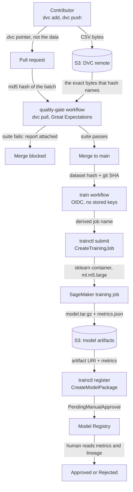

# Retrain Pipeline: CI-Driven Continuous Training, Data Quality Gates, and Human-in-the-Loop Model Governance

[](https://github.com/Go-Santiago-Go/retrain-pipeline/actions/workflows/quality-gate.yml)
[](https://github.com/Go-Santiago-Go/retrain-pipeline/actions/workflows/train.yml)
[](LICENSE)

A model is only as good as the data behind it, and a trained artifact records nothing about what that
data was. This repository is a CI-driven MLOps pipeline that makes data quality a merge requirement
and model promotion a human decision, using:

- **Pull requests** as the only path for labeled data, reviewed like a code change
- **Great Expectations** as unit tests for data, run by **GitHub Actions** and made a required check by branch protection
- **Six expectations** over schema, label domain, nulls, and length, with the failing one named in a PR report
- **DVC** holding the dataset Git cannot, a reviewable md5 pointer in the PR and the bytes in **Amazon S3**
- **The dataset hash** as the model's identity, so a registry entry traces back to the exact rows behind it
- **SageMaker script mode** running one dual-mode `train.py` unchanged on a laptop and on the managed sklearn image
- **A derived training job name** as the idempotency mechanism, so SageMaker itself rejects a duplicate run
- **A frozen holdout** carved once under seed 42, with split logic kept out of `train.py` so nothing can resplit
- **SageMaker Model Registry** holding every candidate as an immutable version, with its holdout metrics and lineage attached
- **`PendingManualApproval`** as the default approval status, gated by an IAM action CI deliberately does not hold
- **A Go CLI** (`trainctl`) the CI runner invokes on merge, over **GitHub OIDC** with no long-lived AWS keys
- **Two IAM roles** scoped by ARN with no wildcard actions, so a compromised runner cannot touch artifacts
- **Terraform** for every resource, with no endpoint, NAT gateway, or GPU, so idle cost is cents of S3 storage

Every one of those fires on the path new labeled data takes from pull request to approved model:

> A contributor runs `dvc push` to store the updated dataset in S3 and opens a PR carrying only its
> hash → the gate runs `dvc pull` to fetch exactly those bytes back, and Great Expectations tests
> that dataset against the suite's data quality expectations, blocking the merge if a single one
> fails → merging names a training job after the data and the commit, so identical inputs can never
> train twice → SageMaker runs `train.py` on the managed sklearn image, writes the model and its
> holdout scores into one artifact in S3, then tears the instance down → `trainctl` registers that
> artifact as a new Model Registry version with its metrics and lineage attached, marked
> `PendingManualApproval` → a human compares it against the incumbent and approves with a stated
> reason.


## Contents

| | |
|---|---|
| [Demo](#demo) | The full loop executed end to end against real AWS, stage by stage |
| [The problem](#the-problem) | Why "the model got worse and nobody knows why" is a data problem, not a modeling one |
| [How it works](#how-it-works) | The two paths and why they trigger differently, the hash that becomes identity, the idempotency mechanism, and where governance lives |
| [Quickstart](#quickstart) | Clone to a trained model on your laptop, then the gate the way CI runs it |
| [Trade-offs](#trade-offs) | Every design decision, what it was chosen over, and why |
| [Results](#results) | Measured metrics, observed pipeline timings, and the run where nothing changed |
| [What I'd do differently](#what-id-do-differently) | Four things a second pass would change |
| [Known gaps and next steps](#known-gaps-and-next-steps) | Deliberately out of scope, named rather than hidden |
| [Repo layout](#repo-layout) · [Documentation](#documentation) | Where each piece lives, and the six deep-dive docs |

## Demo

![Terminal walkthrough in four parts. A data pull request is shown to carry a DVC pointer rather
than a dataset, so 4,460 rows review as four lines. The Great Expectations suite passes on the
merged batch, then the rejected batch from PR #4 is pulled back out of S3 and fails with exit 1,
and the report names the expectation and the one corrupted label out of 4,460 rows. The training
job named after that dataset hash is shown Completed, and the registry entry carrying the same
hash is shown Approved, created by the CI role and approved by a human
user](docs/demo.gif)

**Almost nothing in that recording is a command a developer runs.** `dvc pull data/train.csv.dvc`
and `python training/validate.py data/train.csv` are the `quality-gate` workflow's own steps, run
on a laptop here only so the gate is watchable. On a real data pull request a contributor's
involvement ends at `dvc push` and `git push`, and the next thing they see is a green check or a
red one. The `git checkout fc15046` that swaps in the failing batch stands in for the checkout CI
performs against the PR head, and it pulls the same bytes from the same S3 remote the workflow
reads. The report behind the `jq` query is `training/validation-result.json`, which CI uploads as
the `gx-validation-result` artifact instead of printing, so a blocked merge hands back the
offending row rather than a stack trace.

The two `aws sagemaker` calls are read-only descriptions rather than pipeline steps. `trainctl
submit` created that training job and `trainctl register` filed that model package, both from the
`train` workflow over OIDC with no stored keys, and the approval was a human's. The demo queries
them after the fact because the alternative is watching a four minute training job in a looping
gif. Recorded against the live dataset and this account, so `ce0d529b` appearing in the pointer,
in the job name, and in the registry entry is one hash observed three times rather than three
values that happen to match.

The loop has been demonstrated live, end to end. A batch of 24 hand written labeled messages entered
as a pull request carrying only the changed `.dvc` pointer:

| Stage | Result |
|---|---|
| Quality gate, code-only PR | pass in 5s, `git diff` short-circuits the heavy steps |
| Quality gate, data PR | pass in 56s: OIDC assume, `dvc pull`, full Great Expectations suite |
| A batch that violates the contract | check red, merge blocked, per-expectation report attached |
| Merge to `main` | `train` fires; dataset hash moves `0e703d3d` to `ce0d529b` |
| Training job | `retrain-pipeline-ce0d529b-c36d27a` reached `Completed` |
| Registration | model package version 1, `PendingManualApproval` |
| Human approval | `Approved`, with the comparison stated in the description |

Merge to registered took under four minutes. Nothing in that sequence was simulated.

## The problem

A model in production gets worse. Someone asks which data it was trained on, and the honest answer is
that nobody knows: the training set is a CSV on a laptop that has been appended to a few times, the
job that produced the model ran three weeks ago, and the artifact in S3 is a tarball with a timestamp
for a name.

That is not a modeling problem. Every piece of it is a supply chain problem: nothing validated the
data, nothing bound the artifact to its inputs, and nothing stood between a worse model and
production.

What a fix has to get right, and what each of those requirements costs if you get it wrong:

- **Validate at the merge, not at the training run.** A corrupted training set does not throw an
  error. It trains fine and reports a number that looks fine, so the only cheap place to catch it is
  before it lands.
- **Review data the way code is reviewed.** Labeled rows come from humans, and humans mislabel, paste
  duplicates, and leave empty strings. A batch that no second person looked at is an unreviewed commit
  with a different file extension.
- **Make the data's content its own identity.** A name, a path, and a timestamp all drift. A content
  hash cannot: it is either the bytes that trained the model or it is not.
- **Ship metrics inside the artifact.** Scores recorded beside the weights get separated in transit.
  A model whose evaluation lives in a log line somebody has to find is a model nobody can judge.
- **Make promotion an act, not a default.** Auto-promotion means the first person to read the metrics
  is whoever notices the regression, and a threshold rule is a guess about a distribution nobody has
  looked at.
- **Enforce the gate with a permission, not a policy.** A documented rule that CI must not promote is
  a convention. A missing IAM action is a control, and only one of the two survives someone being in
  a hurry.

This repository does that in the cheapest way available: data enters through the review process code
already uses, the dataset's content hash becomes the identity everything downstream carries, and
promotion requires a human who has to type a reason.

## How it works


```mermaid
flowchart TD
    A[Contributor<br/>dvc add, dvc push] -->|"CSV bytes"| B[(S3: DVC remote)]
    A -->|".dvc pointer, not the data"| C[Pull request]
    C -->|"md5 hash of the batch"| D[quality-gate workflow<br/>dvc pull, Great Expectations]
    B -->|"the exact bytes that hash names"| D
    D -->|"suite fails: report attached"| E[Merge blocked]
    D -->|"suite passes"| F[Merge to main]
    F -->|"dataset hash + git SHA"| G[train workflow<br/>OIDC, no stored keys]
    G -->|"derived job name"| H[trainctl submit<br/>CreateTrainingJob]
    H -->|"sklearn container, ml.m5.large"| I[SageMaker training job]
    I -->|"model.tar.gz + metrics.json"| J[(S3: model artifacts)]
    J -->|"artifact URI + metrics"| K[trainctl register<br/>CreateModelPackage]
    K -->|"PendingManualApproval"| L[Model Registry]
    L -->|"human reads metrics and lineage"| M[Approved or Rejected]
```

Edges carry what moves between stages: a pointer, the bytes it names, a hash, a tarball, an approval
status.

This is the **continuous training** pattern: data and code both enter through Git, validation gates
the merge, the merge triggers training, and the registry gates promotion. The trigger is CI-driven,
not event-driven. There is no queue and no event bus in this design.

Five ideas carry the design, each covered in depth in
[docs/ARCHITECTURE.md](docs/ARCHITECTURE.md):

**The data path and the training path fail differently.** The data path runs on every PR and its
failure mode is a bad merge. The training path runs after a merge and its failure mode is cost. That
asymmetry is why `quality-gate` has no path filter and branches internally on `git diff`, while
`train` does have one: a path-filtered required check never reports on a code-only PR and leaves it
unmergeable forever, but a post-merge job that nothing blocks on can filter safely.

**The dataset hash is the version identity.** Git tracks a pointer holding an md5; S3 holds the bytes.
That hash names the immutable input prefix, forms half the job name, rides in as both a tag and a
hyperparameter, and lands in the model package metadata, so a registry entry walks back to bytes in
five checkable hops.

**The job name is the idempotency mechanism.** `retrain-pipeline-<hash8>-<sha7>` is a deterministic
function of the data and the commit, and SageMaker rejects a duplicate name, so resubmitting identical
inputs fails at the service with no extra logic. A check-then-act existence test would carry a
time-of-check-to-time-of-use race that this does not.

**Two leakage guards, one frozen and one structural.** A stratified holdout was carved once under seed
42 and is DVC-tracked like any other data, and `train.py` contains no split logic at all, so a run
cannot resplit however it is invoked. Inside the model, a single sklearn `Pipeline` fits the
vectorizer on the training fold only.

**CI can propose a model and cannot promote one.** Governance sits in the CLI rather than the training
container, which knows nothing about approval status. `trainctl register` binds an artifact to its
metrics and its lineage and files it as `PendingManualApproval`. The CI role holds
`CreateModelPackage` and deliberately not `UpdateModelPackage`, so the gate is enforced by an absent
permission rather than by policy.

| Subcommand | What it does |
|---|---|
| `trainctl submit` | Derives the job name from the dataset hash and short SHA, calls `CreateTrainingJob`, and polls `DescribeTrainingJob` to a terminal state so a failed job turns the check red rather than passing silently |
| `trainctl register` | Asks the service where the artifact actually landed, streams `metrics.json` out of the tarball, and files a model package version as `PendingManualApproval` with the dataset hash and commit attached |

Both derive the job name independently from the same two inputs, so CI never passes a job name between
steps and cannot get it wrong. Full flag reference, derived S3 paths, timeouts, and exit codes are in
[docs/CLI.md](docs/CLI.md).

Deployed, this is three S3 buckets, two IAM roles, and a model package group, provisioned by one
Terraform stack and reached over GitHub OIDC with no long-lived keys. There is no server, no endpoint,
and nothing that bills while idle, which is why there is no second diagram here showing running
infrastructure: between merges, this pipeline is a set of permissions and buckets. What Terraform
provisions and how to stand it up are in [docs/DEPLOYMENT.md](docs/DEPLOYMENT.md).

## Quickstart

The whole training loop runs locally. Only fetching the dataset touches AWS, and
[docs/LOCAL_DEV.md](docs/LOCAL_DEV.md) has a path around that if you have no access to the remote.

```bash
git clone https://github.com/Go-Santiago-Go/retrain-pipeline.git
cd retrain-pipeline

python -m venv .venv && source .venv/bin/activate
make install     # Python dependencies plus dvc[s3]
make data        # dvc pull: the dataset and the frozen holdout
make train       # train against the holdout, write model.joblib and metrics.json
```

```json
{
  "accuracy": 0.9748878923766816,
  "precision": 1.0,
  "recall": 0.8120805369127517,
  "f1": 0.8962962962962963
}
```

Then run the gate the way CI runs it, and the Go test suite:

```bash
make validate    # the Great Expectations suite, exits nonzero on any failed expectation
make test        # job name derivation, request wiring, S3 URI parsing, tar extraction
```

`make help` lists the rest: `build`, `lint`, `outputs`, the `submit` and `register` pair that drives
SageMaker, and `deploy` and `destroy`. The environment variables `train.py` reads, a path that works
with no AWS access at all, and why there is deliberately no `make split` are in
[docs/LOCAL_DEV.md](docs/LOCAL_DEV.md). To stand the AWS half up yourself, see
[docs/DEPLOYMENT.md](docs/DEPLOYMENT.md).

## Trade-offs

I optimized every choice below for one constraint: the simplest mechanism that makes the guarantee
real, reaching for a service or a moving part only where the guarantee genuinely needs one. Several of
these are deliberately less capable than the alternative, because the thing being demonstrated is the
governance path rather than the model.

| Decision | Choice | Why | Also considered |
|---|---|---|---|
| Idempotency | Derived job name, uniqueness enforced by SageMaker | Atomic and race-free, and the name doubles as human-readable provenance | List jobs and skip if one matches |
| Dataset versioning | DVC pointers in Git, bytes in S3 | A data PR is a few changed lines rather than thousands of rows, and the repo does not grow without bound | Committing CSVs directly, Git LFS |
| Who runs `dvc add` | A human, locally; CI only ever pulls | Automating it means CI committing to `main`, the anti-pattern this design exists to avoid | A CI step that adds and pushes |
| Gate trigger | No path filter, branch inside on `git diff` | A path-filtered required check never reports on a code-only PR, so the PR is unmergeable forever | `paths: data/**` on the workflow |
| Train trigger | Path filter on `data/**` | Nothing blocks on a post-merge job, so filtering deadlocks nothing, and a training job bills | Running on every merge |
| AWS identity | Two IAM roles, `iam:PassRole` scoped to one role and one service | A compromised runner can launch a job as the tightly scoped execution role but never touch artifacts directly | One combined role |
| Registration owner | The Go CLI, after the job completes | The training container should not know what a registry or an approval status is | A `CreateModelPackage` call at the end of `train.py` |
| Metrics object key | The training job name | Metrics describe a run, so a dataset-keyed object would overwrite numbers a registered package already points at | The dataset hash |
| Training image | AWS-managed sklearn, script mode | No image to build, push, scan, or keep patched, and the version gap is one TF-IDF and LogisticRegression are stable across | A custom training image in ECR |
| The model | TF-IDF + LogisticRegression | The model is a payload for the governance machinery, and a better classifier would prove nothing this project is about | Anything more capable |
| Promotion | Human approval, enforced by an absent IAM action | A threshold is a guess about a distribution nobody has looked at, and it handles the identical-metrics case badly | Auto-promote above a threshold |
| Terraform layout | One stack | Nothing bills at rest, so there is no billable stack to destroy between sessions | Bootstrap plus app stacks |
| State locking | S3 native, `use_lockfile = true` | One less resource to provision and pay for, now that S3 does conditional writes | A DynamoDB lock table |

The pattern under all of it is that a guarantee should be structural rather than procedural. The
uniqueness check lives in SageMaker, the leakage guard lives in a script that training does not
import, and the approval gate lives in an IAM policy with a permission missing from it. Each of those
could have been a documented rule instead, and each would then hold only as long as everyone
remembered it.

Go with aws-sdk-go-v2 for the CLI, Python with scikit-learn for training, DVC for dataset versioning,
Great Expectations for the gate, SageMaker Training and Model Registry for the cloud half, and
Terraform and GitHub Actions to provision and drive it.

## Results

**Measured**

| | |
|---|---|
| Accuracy | 0.9749 |
| Precision | 1.0000 |
| Recall | 0.8121 |
| F1 | 0.8963 |

Measured against the frozen holdout of 1,115 rows, so the numbers stay comparable across every
retrain rather than against a fresh split. Precision and recall stay separate because their costs differ: a
false positive junks a real message, while a false negative merely lets one spam through, and a single
headline number would hide exactly the trade a reviewer needs to see. Reproduce with `make train`
([how](docs/LOCAL_DEV.md)).

**Observed.** Timings from the demonstrated run, which are observations of specific GitHub Actions
runs rather than benchmarks, since a hosted runner is not a controlled environment:

| Stage | Observed |
|---|---|
| Quality gate, code-only PR | 5s |
| Quality gate, data PR | 56s |
| Merge to registered model package | under 4 minutes |

Demonstrated end to end, not just locally: a 24-row batch entered as a pull request, the gate passed,
the merge fired `train`, job `retrain-pipeline-ce0d529b-c36d27a` reached `Completed`, `register` filed
version 1 as `PendingManualApproval`, and a human approved it with the comparison stated. Nothing in
that sequence was simulated. This repo is a pipeline rather than a service, so there is no URL to
publish and nothing left running between merges.

That run also produced the most useful result in the project: **the candidate scored identically to
the previous model on every metric.** Comparing the artifacts directly, the vocabulary grew from 7,714
to 7,726 terms and the intercept moved from -2.46755088 to -2.47247791, so every coefficient shifted.
24 new rows against 4,459 moved the decision boundary by less than it took to flip any of the 1,115
holdout predictions. The model is provably different and measurably identical, which is exactly the
case a threshold rule handles badly and a human handles fine. The reviewer's side of that call is in
[docs/OPERATIONS.md](docs/OPERATIONS.md).

## What I'd do differently

Four things I would change on a second pass, separate from the scoping calls below. These are
hindsight, not parked work.

**Wire the Go tests into CI on day one.** `make test` passes locally and nothing enforces it on a pull
request, which means the test suite is a habit rather than a control. Everything else in this project
is about the difference between those two things, so leaving the Go tests unenforced is the one
inconsistency I would not repeat.

**Register the pre-existing model as version 1 before adding data.** The first candidate had no
incumbent to compare against, which forced the reviewer runbook to grow a whole branch for "when there
is no incumbent." Registering the baseline first would have made the very first approval a real
comparison and left the runbook simpler.

**Take the dataset pointer path as a flag rather than hardcoding it.** `trainctl` reads
`data/train.csv.dvc` and `data/holdout.csv.dvc` as constants. That is correct for one model, but it
means a second dataset is a code change rather than a configuration change, and the fix costs two
flags.

**Split the Terraform into two stacks anyway.** One stack seemed right because nothing bills at rest,
but it created the chicken-and-egg where the configuration owns the bucket holding its own state, and
the first apply plus migration dance is now a documented step. The sibling repos' bootstrap-plus-app
split avoids it for free.

## Known gaps and next steps

Deliberately out of scope, named rather than hidden. Each has a real answer I would reach for if the
workload demanded it, and each is a scoping call I can defend.

**No CI runs the Go tests.** There is no `ci.yml` in this repository. `make test` and `make lint` pass
locally and nothing enforces either on a pull request, so the Go suite is a habit rather than a
control. That is the one inconsistency I would fix first, because the difference between a habit and a
control is the entire subject of this project, and the data path gets it right while the code path
does not.

**One dataset and one model, by design.** `trainctl` reads `data/train.csv.dvc` and
`data/holdout.csv.dvc` as constants, so a second dataset is a code change rather than a configuration
change. Supporting more would change the CLI's shape and not just its flags: the job name derivation,
the S3 prefixes, and the model package group would each need a dataset dimension. For a pipeline that
trains one model against one frozen holdout, that generality is cost with no buyer.

**The expectation suite is deliberately small.** Six expectations cover the contract that has actually
been violated: exact schema, label domain, nulls on both columns, text length, and a row count floor.
There is no distributional check and no duplicate-row check. Expanding the suite before something
breaks is guessing at which failure comes next, and an expectation that has never fired is maintenance
with no evidence behind it.

**The holdout is frozen, so it erodes slowly.** Every model is judged against the same 1,115 rows,
which is what keeps metrics comparable across retrains and is also what limits them. Enough candidates
judged against one test set eventually overfits the selection process to that set, even though no
single training run ever sees it. This project is nowhere near that point, and rotating the holdout
would trade comparability for freshness, which is the wrong trade at this scale.

**Nothing deploys the approved model.** Approval marks a version promotable and stops there. Serving
it is `inference-gateway`'s job and the handoff between the two repositories is manual. Automating it
would mean the registry triggering a deployment, which is a second pipeline with its own rollback
story rather than an extension of this one.

**No drift detection and no scheduled retraining.** Retraining fires on a data merge and nothing else.
Detecting distribution shift means monitoring production inference, which this repository does not
own. A scheduled retrain on unchanged data would derive a job name that already exists and be rejected
by the idempotency mechanism, which is correct behavior rather than a limitation.

**No model card and no fairness evaluation.** For a spam classifier trained on a public research
corpus, the governance story that matters is lineage and human approval. A model making decisions
about people would need documented intended use, subgroup performance, and a bias review before any of
this counted as governance.

Also parked: a feature store, a multi-environment split between staging and production registries, and
a Git tag per dataset version.

## Repo layout

| Path | Contents |
|---|---|
| `cmd/trainctl/` | The Go CLI. `submit` and `register` are the two subcommands; `name.go` derives the idempotent job name, and the request builders are pure functions so a table test can assert the wiring without AWS. |
| `training/train.py` | Dual-mode training. Reads `SM_CHANNEL_TRAIN` and `SM_MODEL_DIR`, defaults them to local paths, and writes `metrics.json` beside the model so the scores travel inside the artifact. |
| `training/split_dataset.py` | The one-shot holdout carve, under seed 42. Ran once and must never run again; kept out of `train.py` so a run cannot resplit. |
| `training/validate.py` | The Great Expectations suite. Exits nonzero on any failed expectation, which is the entire gate mechanism. |
| `data/` | DVC pointer files only, never the data itself. |
| `terraform/` | Three buckets, two IAM roles, the model package group, and a data source reading the account-global OIDC provider it deliberately does not own. |
| `.github/workflows/` | `quality-gate` runs on every PR and branches inside on `git diff`; `train` runs on merges touching `data/**`. The asymmetry is deliberate and is the most counterintuitive decision in the repo. |
| `docs/` | Architecture, CLI reference, local development, deployment, operations, conventions. |
| `Makefile` | Task runner. Same verbs as the other repos in this portfolio; `make help` lists them. |

## Documentation

| Doc | What is in it |
|---|---|
| [docs/ARCHITECTURE.md](docs/ARCHITECTURE.md) | The two paths and why they are triggered differently, the hash as identity, the idempotency mechanism, both leakage guards, and where the governance boundary sits |
| [docs/CLI.md](docs/CLI.md) | `trainctl` reference: both subcommands, every flag, the values each derives rather than takes, and exit codes |
| [docs/LOCAL_DEV.md](docs/LOCAL_DEV.md) | Clone to a trained model, the no-AWS path, the environment variables `train.py` reads, and why there is no `make split` |
| [docs/DEPLOYMENT.md](docs/DEPLOYMENT.md) | What gets provisioned, the SageMaker quota that blocks everything, the state migration, branch protection, and teardown |
| [docs/OPERATIONS.md](docs/OPERATIONS.md) | The reviewer runbook, cost, the failure modes and the command that diagnoses each, and honest constraints |
| [docs/CONVENTIONS.md](docs/CONVENTIONS.md) | How the docs are structured, and the accuracy guards every claim in them has to survive |

## License

MIT. See [LICENSE](LICENSE).
