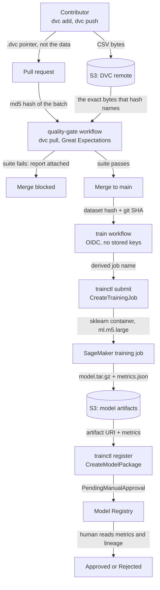

# Architecture

How the pipeline is put together, and why each boundary sits where it does. What Terraform
provisions is in [DEPLOYMENT.md](DEPLOYMENT.md); the CLI's flags and exit codes are in
[CLI.md](CLI.md).

Reading with limited time, three files carry the work this document explains:
[`cmd/trainctl/submit.go`](../cmd/trainctl/submit.go) for the derived job name, the double-carried
lineage, and the poller that turns a failed job into a red check;
[`cmd/trainctl/register.go`](../cmd/trainctl/register.go) for streaming metrics out of the tarball and
the governance boundary at `PendingManualApproval`; and
[`.github/workflows/quality-gate.yml`](../.github/workflows/quality-gate.yml) for why the gate runs on
every PR and branches inside.



## The data path and the training path

There are two paths through this repository and they fail differently, which is why they are separate
workflows rather than one.

The **data path** runs on every pull request. It answers "is this batch allowed in," and its failure
mode is a bad merge: rows that violate the contract reaching `main` and silently corrupting every
model trained afterwards. It is cheap, it runs constantly, and it must never be skippable.

The **training path** runs after a merge. It answers "what model does this data produce," and its
failure mode is cost: a training job bills, so it must not fire on a README change. It is the only
part of this system that spends money.

That difference drives an asymmetry in how the two workflows are triggered, and it is the single
most counterintuitive decision in the repo. `quality-gate` has **no path filter** and runs on every
PR, branching internally on a native `git diff` to decide whether to do the expensive validation. A
path-filtered required check never reports a status on a code-only PR, and a required check that
never reports stays pending forever, so the PR becomes unmergeable. Running always and branching
inside keeps the check honest for every PR shape. `train` **does** have a path filter on `data/**`,
and can safely, because it is a post-merge job rather than a required check: nothing waits on its
status, so filtering it deadlocks nothing while stopping a code-only merge from launching a billable
job.

The rule that falls out: *path filters are safe on jobs nothing blocks on, and dangerous on required
checks.*

## The dataset hash is the version identity

Git tracks a `.dvc` pointer file holding an md5, a size, and a path. The CSV bytes live
content-addressed in an S3 remote. So a pull request carries a hash, not a dataset, and reviewing one
means reviewing a few changed lines rather than a diff of thousands of rows.

That hash then becomes the dataset's identity everywhere downstream. It names the immutable S3 input
prefix the training job reads, it forms half of the training job's name, it rides into the job as
both a tag and a hyperparameter, and it lands in the model package's metadata. A reviewer holding a
registry entry can walk it back to bytes:

```
model package metadata → git_sha → the .dvc pointer at that commit → md5 → the CSV in S3
```

Every hop in that chain is independently checkable, which is what makes the lineage claim more than
a label. [OPERATIONS.md](OPERATIONS.md) has the commands.

**CI never writes data.** It only ever runs `dvc pull`. Automating `dvc add` in CI would mean CI
committing to `main`, which is exactly the anti-pattern this design exists to avoid: humans propose
data, and the gate plus a human dispose.

## The job name is the idempotency mechanism

`trainctl` derives the training job name as `retrain-pipeline-<hash8>-<sha7>` from the dataset hash
and the short commit SHA. Both `submit` and `register` derive it independently from the same two
inputs, so CI never has to pass a job name between steps and cannot get it wrong.

The name is doing real work. Because it is a deterministic function of the data and the commit, and
because SageMaker rejects a duplicate training job name, resubmitting identical inputs fails at the
service with no extra logic on this side. **That is the idempotency guarantee, and it is deliberately
not a check-then-act existence test.** Listing jobs and skipping if one matches carries a
time-of-check-to-time-of-use race, where two concurrent merges both see no match and both submit. It
also costs an extra API call and more code. Pushing the uniqueness check to the server is atomic,
race-free, and simpler, and the name doubles as human-readable provenance.

The trade is that a genuine re-run needs a new commit. That is the correct default for a system whose
whole premise is that a model traces to an exact dataset and commit.

## Two leakage guards, one frozen and one structural

Test-set leakage is the failure that makes every metric in this repo meaningless, so it is guarded
twice, in two different ways.

**The frozen holdout.** `training/split_dataset.py` ran exactly once, carving a stratified 20 percent
split under seed 42 into `data/holdout.csv`, which is then DVC-tracked like any other data. It is the
fixed ruler every future model is measured against, so metrics stay comparable across retrains. The
guard is not that the script is careful, it is that **the script is not part of training**: `train.py`
has no split logic in it at all, so a training run structurally cannot resplit no matter how it is
invoked.

**The single Pipeline.** The model is a TF-IDF vectorizer plus LogisticRegression wrapped in one
`sklearn.Pipeline`. That wrapper is the leakage guard, not a stylistic choice: it fits the vectorizer
on the training fold only and reuses it unchanged on the holdout. Fitting the vectorizer separately,
which is the obvious-looking alternative, leaks holdout vocabulary into the features and inflates
every score.

The model itself stays deliberately boring. It is a payload for the governance machinery, and
upgrading it proves nothing this project is trying to prove.

## The training script is dual-mode so one file runs in both places

`training/train.py` reads `SM_CHANNEL_TRAIN` and `SM_MODEL_DIR`, the environment variables SageMaker
script mode injects, and defaults both to local paths:

```python
TRAIN_DIR = Path(os.environ.get("SM_CHANNEL_TRAIN", "data"))
MODEL_DIR = Path(os.environ.get("SM_MODEL_DIR", "training/model"))
```

The identical file therefore runs on a laptop and in the cloud with no branching, no `if
IN_SAGEMAKER`, and no second copy to keep in sync. Locally it reads `data/` and writes
`training/model/`; in the container SageMaker sets both variables and then tars whatever landed in
the model directory into `model.tar.gz`.

That tarring behavior is why `metrics.json` is written *into the model directory* rather than
uploaded separately: the metrics travel inside the same artifact as the weights, so a model and the
scores it earned cannot be separated in transit.

The container runs the AWS-managed sklearn 1.4 image while local development uses a newer sklearn.
The TF-IDF and LogisticRegression APIs are stable across that gap, so the same file works in both,
and `requirements.txt` is deliberately **not** shipped into the container so it keeps its own pinned
runtime rather than pip-installing a newer one over itself.

## Governance lives in the CLI, not in the training script

A trained artifact sitting in S3 is only weights. It records no evaluation, no lineage, and no sign
off, so nothing about the object itself can gate promotion. `trainctl register` is what turns it into
a versioned **model package**: an immutable registry entry binding the artifact to the metrics it
earned, the data and commit it came from, and an approval status.

`register` asks `DescribeTrainingJob` where the artifact actually landed rather than rebuilding
SageMaker's output path convention locally, because the service is authoritative and a
reimplementation would go stale silently if AWS changed the layout. It refuses to register anything
but a `Completed` job, which also guarantees the `ModelArtifacts` field is populated.

Because `ModelMetrics` takes an S3 URI rather than numbers, the CLI streams `metrics.json` out of the
tarball and republishes it as `metrics/<job name>.json`. The tarball stays the source of truth; the
S3 copy is a projection the console can render. **The key is the job name, not the dataset hash**,
because metrics describe a run: two commits training on identical data produce different scores, and
a dataset-keyed object would overwrite numbers a registered package already points at.

Registration happens in the Go CLI rather than at the end of the training script on purpose. The
training container's job is to train and write artifacts; it knows nothing about approval status or
registries. Governance policy lives in one place, and that place is not the code that touches the
data.

## Two IAM roles, and the one permission CI does not have

The CI role and the SageMaker execution role are separate, and the separation is the security story.

CI needs to *start* jobs and pass the execution role to SageMaker. The execution role is what the job
assumes to read input and write artifacts. A single combined role would hand anyone who could trigger
CI, or who compromised the runner, the union of both: the power to launch jobs and to read and write
the model-artifacts bucket directly. Split, a compromised runner can only launch a job that runs as
the tightly scoped execution role, and can never touch artifacts itself.

The CI role's `iam:PassRole` is scoped to that one execution role and to SageMaker alone, which closes
the escalation path where CI passes a more privileged role to a service. The attack prevented is
privilege escalation from a compromised CI pipeline into the model store.

Then the governance boundary itself. The CI role holds `CreateModelPackage`, `DescribeModelPackage`,
and `ListModelPackages`, and **deliberately not `UpdateModelPackage`**. Approval status is changed
only by `UpdateModelPackage`. So CI can propose a version and read the registry, but it structurally
cannot approve one: promotion requires a principal that CI is not. The human gate is enforced by the
absence of a permission rather than by policy, which is the difference between a control and a
convention.
